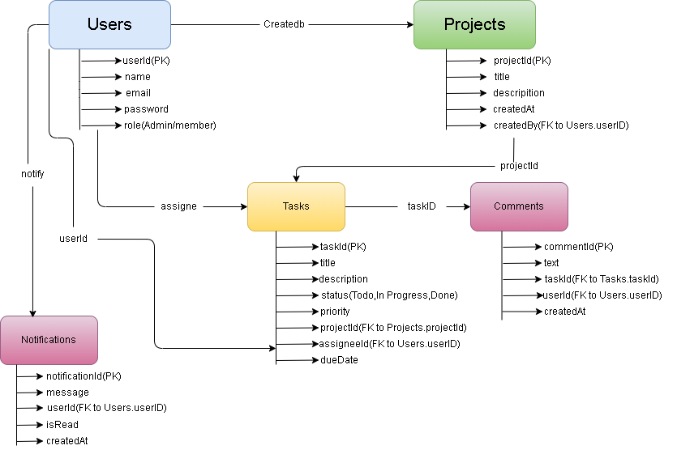
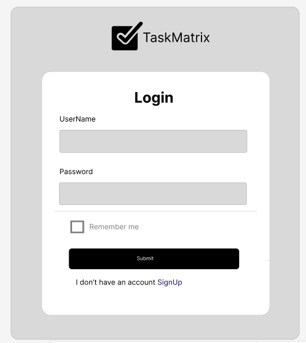
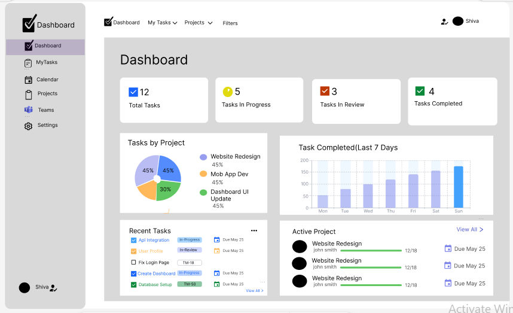
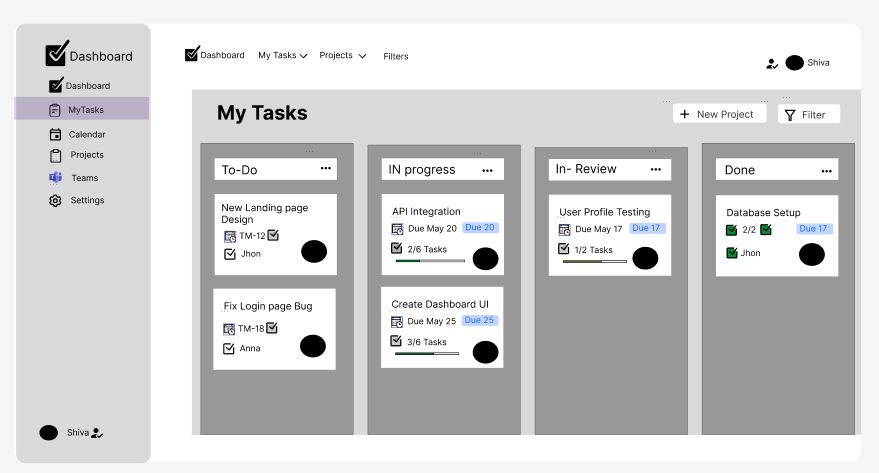
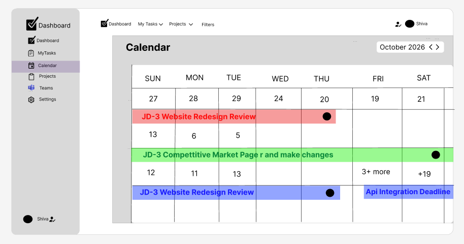
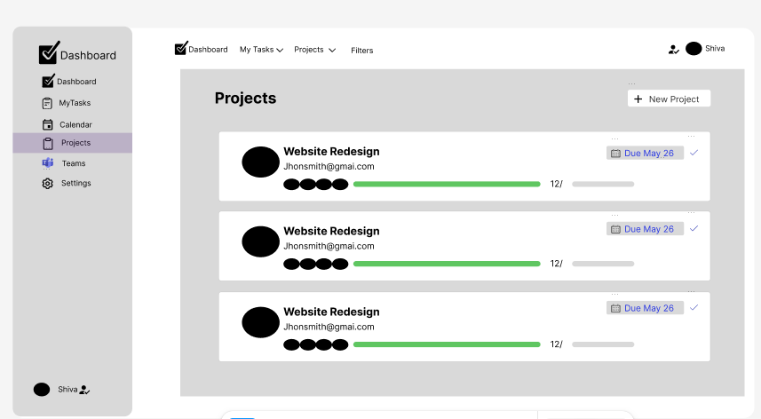
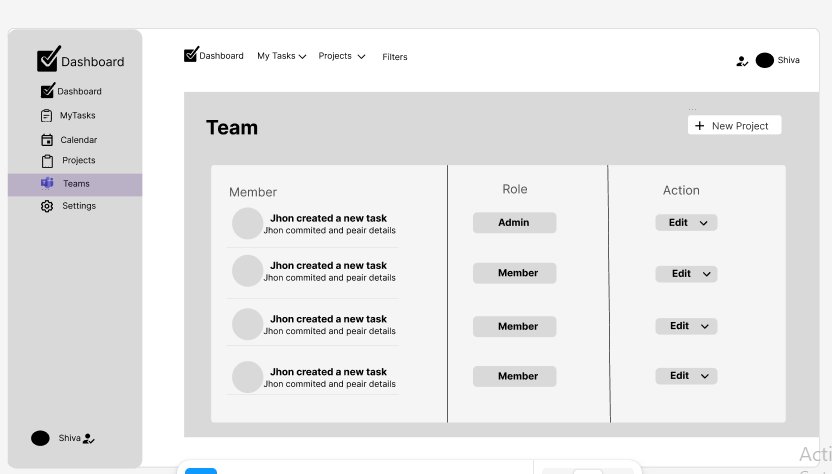

# TaskMatrix – Enterprise Project Management Tool

## 📄 Project Description
TaskMatrix is a high-performance **Full Stack Project Management Tool** designed to help software teams manage projects and tasks efficiently. Built as a **Capstone Project** to demonstrate full-stack skills, UI design, and database architecture.

---

## 🎯 Project Objective
The main objective of this project is to:
- Build a scalable full-stack application
- Implement project and task management workflows
- Design a modern UI using Figma
- Create a structured database architecture
- Demonstrate CRUD operations

---

## 🚀 Core Features
- User Registration and Login System
- Role-based Authentication (Admin / Member)
- Create and Manage Projects
- Create Tasks under Projects
- Assign Tasks to Team Members
- Update Task Status (Todo, In Progress, Done)
- Add Comments to Tasks
- Notification System
- Dashboard Overview
---

## 🛠️ Tech Stack
- **Frontend:** React.js, Tailwind CSS
- **Backend:** Node.js, Express.js
- **Database:** MongoDB

---

## 📐 UI Design & Architecture
🔗 **Figma Design:** [View Figma Wireframes](https://www.figma.com/design/PBxKgys1iA4pJkkuS2b1cI/prodesk-capstone-TaskMatrix?node-id=0-1&t=ouNdVQb5a6z96zbH-1)

**ER Diagram:**

---

## 📸 UI Screenshots
 
 
 

⚙️ Installation & Setup
1. Clone Repository
git clone [https://github.com/technoshiva123/prodesk-capstone-TaskMatrix.git](https://github.com/technoshiva123/prodesk-capstone-TaskMatrix.git)

2. Install & Run Backend
cd prodesk-capstone-TaskMatrix && npm install && npm start

3. Run Frontend
cd frontend && npm install && npm start

🧪 API Testing (Postman)
-POST /api/users/register - User Signup
-POST /api/users/login - User Login
-GET /api/projects - Fetch all projects
-POST /api/tasks - Create new task
---

📚 References
-React: https://react.dev/
-Node.js: https://nodejs.org/
-Express: https://expressjs.com/
-MongoDB: https://www.mongodb.com/

---

🎥 Demo Video
Project Explanation Video Link:
🔗 Watch Demo Video on YouTube/Loom

## 📂 Folder Structure

prodesk-capstone-TaskMatrix/
├── backend/        # API Server
├── frontend/       # React App
├── images/         # Documentation Assets
└── README.md

👨‍💻 Author
Name: Shivansh Vishwakarma
Course: Bachelor of Computer Applications (BCA)
Project: Capstone Project – TaskMatrix
Track: Full Stack Development