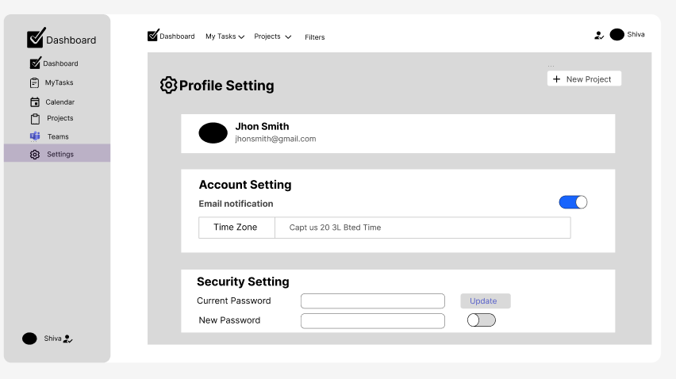

# TaskMatrix – Enterprise Project Management Tool

## 📄 Project Description
TaskMatrix is a high-performance **Full Stack Project Management Tool** designed to help software teams manage projects and tasks efficiently. This system enables users to create projects, assign tasks, track progress, collaborate through comments, and receive notifications.

It is built as part of a **Capstone Project** to demonstrate full-stack development skills including UI design, backend architecture, and database relationships.

---

## 🎯 Project Objective
The main objective of this project is to:
- Build a scalable full-stack application
- Implement project and task management workflows
- Design a modern UI using Figma
- Create a structured database architecture
- Demonstrate CRUD operations

---

## 🚀 Core Features
- User Registration and Login System
- Role-based Authentication (Admin / Member)
- Create and Manage Projects
- Create Tasks under Projects
- Assign Tasks to Team Members
- Update Task Status (Todo, In Progress, Done)
- Add Comments to Tasks
- Notification System
- Task Due Date Management
- Dashboard Overview

---

## 🛠️ Tech Stack
### Frontend
- React.js, Tailwind CSS, JavaScript (ES6+)

### Backend
- Node.js, Express.js

### Database
- MongoDB

---

## 📐 UI Wireframes (Figma Design)
The UI wireframes for this project were designed using **Figma**.

🔗 **Figma Design Link:** [TaskMatrix Figma Design](https://www.figma.com/design/PBxKgys1iA4pJkkuS2b1cI/prodesk-capstone-TaskMatrix?node-id=0-1&t=ouNdVQb5a6z96zbH-1)

---

## 🗂️ Architecture Diagram (ER Diagram)
The following **Entity Relationship Diagram (ERD)** represents the database structure used in this project.


---

## 📸 UI Screenshots

### Login Page


### Dashboard


### Tasks Page


### Calendar Page


### Projects Page


### Team Page


### Settings Page


---

## 📂 Folder Structure
```text
prodesk-capstone-TaskMatrix/
├── backend/
├── frontend/
├── images/
│   ├── drawio.png
│   ├── S1.png
│   ├── S2.png
│   └── ...
└── README.md

⚙️ Installation Steps
Follow these steps to run the project locally.

Step 1: Clone Repository

git clone [https://github.com/technoshiva123/prodesk-capstone-TaskMatrix.git](https://github.com/technoshiva123/prodesk-capstone-TaskMatrix.git)

Step 2: Navigate to Project Folder

cd prodesk-capstone-TaskMatrix

Step 3: Install Dependencies

npm install

Step 4: Run Backend

npm start
Step 5: Run Frontend

cd frontend
npm start

🧪 API Testing
All backend APIs were tested using Postman.

POST /api/users/register - User Signup
POST /api/users/login - User Login
GET /api/projects - Fetch all projects
POST /api/tasks - Create new task

📚 References
React: https://react.dev/
Node.js: https://nodejs.org/
Express: https://expressjs.com/
MongoDB: https://www.mongodb.com/

🎥 Demo Video
Project Explanation Video Link:
🔗 Watch Demo Video on YouTube/Loom

👨‍💻 Author
Name: Shivansh Vishwakarma
Course: Bachelor of Computer Applications (BCA)
Project: Capstone Project – TaskMatrix
Track: Full Stack Development